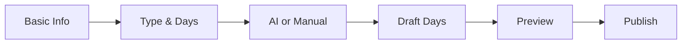

# 🎨 L-OSIRIS Frontend UX Flow & Wireframe Specification

*(Figma-ready, Engineering-aligned)*

---

## 0. UX Design Fundamental Principles (Non-Negotiable)

These are **design hard rules**.
Every screen **must comply**:

1. **Viewers must never need to understand the system**
2. **Content is always the protagonist; UI must step back**
3. **Viewer experience must never feel like a dashboard**
4. **Curator ≠ Viewer (completely different experience layers)**
5. **Governance and permissions exist only in the Admin world**

---

# 1️⃣ Viewer App UX (Most Critical)

## 1.1 Viewer UX Full Flow

```mermaid
flowchart TD
A[NFC Scan] --> B[/t/public_tag_id]
B --> C{Has Active Run?}
C -->|Yes| D[Resume Run]
C -->|No| E[Activate Exhibition]
E --> F[Day 1 Viewer]
F --> G[Auto Progress by Time]
G --> H{Completed?}
H -->|Yes| I[Completion Screen]
I --> J[Gallery or Exit]
```

---

## 1.2 Viewer Entry Page

### `/t/{public_tag_id}`

### UX Goal

> **Like opening a letter, not entering an app**

### Wireframe Blocks

```
┌───────────────────────────────┐
│                               │
│   (Minimal loading animation) │
│                               │
│   “This exhibition begins”    │
│                               │
│        [ Start ]               │
│                               │
│   * No login                   │
│   * No branding noise          │
└───────────────────────────────┘
```

### Rules

* No Header / Footer
* No account prompts
* No Gallery link (unless explicitly allowed)
* After Start, **Exhibition Version is immediately locked**

---

## 1.3 Exhibition Day Viewer

### `/run/{run_id}`

### UX Core

> **Like reading a book where only one page can be turned per day**

---

### Main Screen Wireframe

```
┌───────────────────────────────┐
│                               │
│   [ Day Content (HTML+CSS) ]  │
│                               │
│   (Full viewport, scrollable) │
│                               │
│                               │
│                               │
│                               │
│                               │
│                               │
│                               │
│───────────┬───────────────────│
│  ❤️  👍  🕊 │   Day 12 / 365   │
└───────────┴───────────────────┘
```

---

### Interaction Rules

* ❌ No “Next Day” button
* ❌ No Day Jump
* ✅ Progression depends entirely on backend time
* ✅ Emoji reactions are fire-and-forget (non-blocking)

---

### Overlay Controls (Gesture or Long-Press)

```
┌───────────────────────────────┐
│   Resume / Pause               │
│   Restart from Day 1           │
│   Exit                         │
└───────────────────────────────┘
```

* Overlay hidden by default
* Must not interrupt immersion

---

## 1.4 Completion Screen

### UX Positioning

> **Not an ending, but a release**

```
┌───────────────────────────────┐
│                               │
│   “This exhibition is complete”│
│                               │
│   Thank you for viewing        │
│                               │
│   [ Return to Gallery ]        │
│   [ Close ]                    │
│                               │
└───────────────────────────────┘
```

---

## 1.5 Gallery (If Allowed)

### `/gallery`

### Design Principle

* Should feel more like a **gallery wall**, not e-commerce

```
┌───────────────────────────────┐
│  PUBLIC EXHIBITIONS            │
│                               │
│  ┌───────┐  ┌───────┐         │
│  │ Cover │  │ Cover │         │
│  │ Title │  │ Title │         │
│  └───────┘  └───────┘         │
│                               │
└───────────────────────────────┘
```

---

# 2️⃣ Curator Dashboard UX

## 2.1 Dashboard Home

```
┌───────────────────────────────┐
│ Exhibitions                   │
│ ├ Draft (3)                   │
│ ├ Published (2)               │
│ └ Archived (5)                │
│                               │
│ [ + New Exhibition ]          │
└───────────────────────────────┘
```

---

## 2.2 Create Exhibition – Step Flow



---

## 2.3 AI Studio (Key Page)

### Layout

```
┌───────────────────────────────┐
│ Prompt Input                  │
│ ──────────────────────────── │
│ “Write a 365-day exhibition…” │
│                               │
│ Media Library (right panel)   │
│                               │
│ [ Generate Draft ]            │
└───────────────────────────────┘
```

---

### Draft Review

```
┌───────────────────────────────┐
│ Day List                      │
│ 01 02 03 ... 365              │
│                               │
│ Preview Panel                 │
│ [Rendered HTML Preview]       │
│                               │
│ [ Regenerate Day ]            │
│ [ Edit HTML ]                 │
└───────────────────────────────┘
```

---

## 2.4 Exhibition Analytics (Read-only)

```
┌───────────────────────────────┐
│ Total Runs: 124               │
│ Completion: 68%               │
│                               │
│ Day 12 ❤️❤️❤️❤️❤️              │
│ Day 45 👍👍👍                  │
└───────────────────────────────┘
```

---

# 3️⃣ Super Admin Portal UX

## 3.1 Access Gate

* VPN only
* OTP mandatory
* No public routing

---

## 3.2 Admin Dashboard

```
┌───────────────────────────────┐
│ Curators                      │
│ NFC Inventory                 │
│ Governance Policies           │
│ Audit Logs                    │
└───────────────────────────────┘
```

---

## 3.3 Governance Toggle Screen

```
┌───────────────────────────────┐
│ Curator: John Doe             │
│                               │
│ NFC Lockdown: [ ON / OFF ]    │
│                               │
│ ⚠️ This action is audited     │
│ [ Confirm ]                   │
└───────────────────────────────┘
```

---

# 4️⃣ Design System (Figma Guidelines)

## Color

* Neutral base
* Low-contrast UI
* Content colors remain untouched

## Typography

* Serif or elegant sans-serif
* Optimized for long-form reading

## Motion

* Slow and intentional
* No gamification effects

---

# 5️⃣ Frontend × Backend Integration Contract

The frontend **must only do these three things**:

1. Render backend-approved content
2. Reflect backend state
3. Send user intent (emoji / pause / restart)

❌ Frontend must not calculate Day
❌ Frontend must not determine permissions
❌ Frontend must not decide routing
